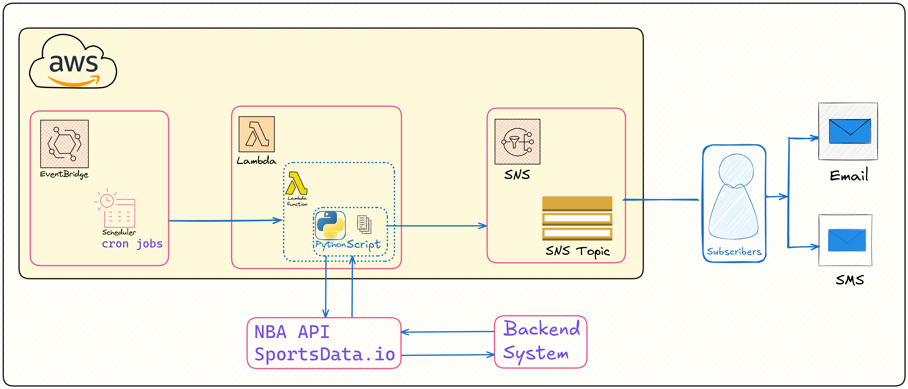
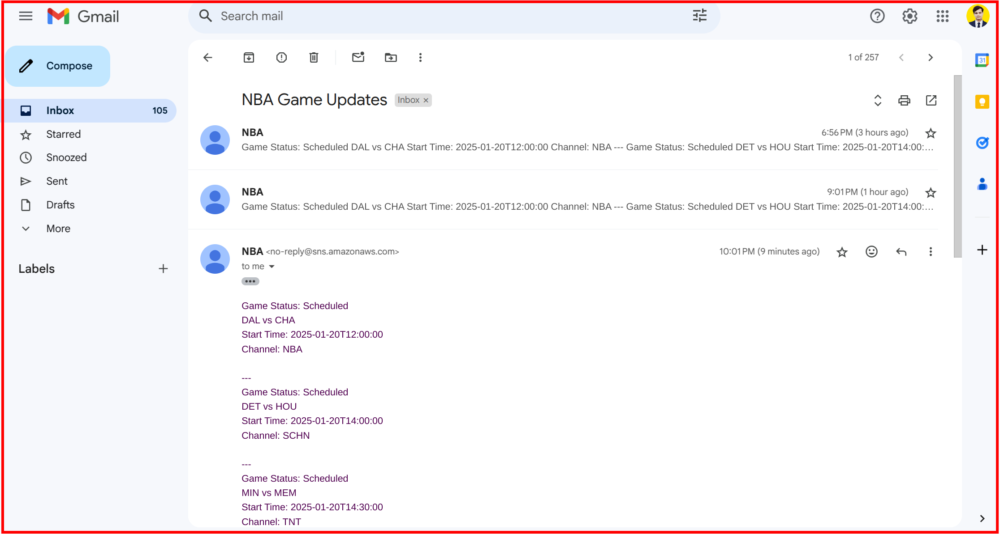

# NBA Game Day Notification Alert

<details>
<summary>Quick Navigation</summary>

- [NBA Game Day Notification Alert](#nba-game-day-notification-alert)
  - [Project Overview](#project-overview)
    - [Objective](#objective)
    - [Features](#features)
  - [Architecture](#architecture)
    - [System Design](#system-design)
    - [Workflow](#workflow)
  - [Technologies Used](#technologies-used)
  - [Project Structure](#project-structure)
  - [Prerequisites](#prerequisites)
  - [How to Setup](#how-to-setup)
    - [Step 1: Set Up Amazon SNS](#step-1-set-up-amazon-sns)
    - [Step 2: Subscribe to the SNS Topic](#step-2-subscribe-to-the-sns-topic)
    - [Step 3: Set Up AWS Lambda](#step-3-set-up-aws-lambda)
    - [Step 4: Write the Lambda Function Code](#step-4-write-the-lambda-function-code)
    - [Step 5: Configure Amazon EventBridge](#step-5-configure-amazon-eventbridge)
  - [Expected Output](#expected-output)
  - [Future Development](#future-development)
  - [Blog🔗](#blog)
  - [Contributing](#contributing)
  - [License](#license)
  
</details>

## Project Overview

### Objective
The goal of this project is to create a notification system that leverages AWS services to deliver timely messages based on specific NBA game day events.

### Features
- Real-time notifications for NBA game updates.
- Integration with AWS Lambda, SNS, and EventBridge.
- Scalable and efficient event-driven architecture.

## Architecture


### System Design

1. **Event Source**: NBA game day events.
2. **Processing**: AWS Lambda function to process events and send notifications.
3. **Notification**: Amazon SNS for delivering messages to subscribers.
4. **Scheduling**: Amazon EventBridge is configured with a cron job to trigger events at specified intervals, ensuring timely notifications.

### Workflow

1. SNS publishes the notification to subscribers.
2. Lambda function written in Pyrhon processes the events, fetch & formats the data.
3. EventBridge triggers Lambda function according to cron-job.


## Technologies Used
| Category        | Technologies              |
|-----------------|---------------------------|
| Programming     | Python                    |
| Event Processing| AWS Lambda                |
| Messaging       | Amazon SNS                |
| Event Management| Amazon EventBridge        |

## Project Structure
```
NBA Game Day Notification Alert/
├── .github/
│   └── PULL_REQUEST_TEMPLATE.md # Template to create pull request
├── Assets                       # Screenshots 
├── Policies/
│   └── gdn_sns_policy.json      # SNS policy for permissions
├── src/
│   └── gdn.py                  # Lambda function code
└── README.md                   # Project documentation
```

## Prerequisites

- AWS account with permissions for Lambda, SNS, and EventBridge.
- Python 
- [Get SportData.io API](https://sportsdata.io/cart/free-trial)

## How to Setup

### Step 1: Set Up Amazon SNS

- Create a new SNS topic named "GameDayNotifications".
- Configure the topic settings as needed.

### Step 2: Subscribe to the SNS Topic

- Add a subscription to the SNS topic using your preferred protocol (Email/SMS).
- Confirm the subscription via the endpoint.
  

### Step 3: Set Up AWS Lambda

- Navigate to AWS Lambda in the AWS Management Console.
- Create a new Lambda function named "GameDayNotificationHandler" with Python 3.8 runtime.
- Assign a role with basic Lambda permissions.
 
 


### Step 4: Write the Lambda Function Code

- Use the provided `gdn.py` script in the `src/` directory.
- Ensure the script imports necessary AWS SDK modules and handles event data.
  

### Step 5: Configure Amazon EventBridge

- Create a new rule in EventBridge named "GameDayEventRule".
- Define the event pattern and set the target to the Lambda function.
  
- **Email Verification**:
  - Check your email inbox for a subscription confirmation message from Amazon SNS.
  - Confirm the subscription by clicking on the provided link.


## Expected Output

1. **Notification Delivery**:
    - Once the setup is complete, simulate an NBA game day event in Amazon EventBridge.
    - Verify that the Lambda function processes the event correctly.
    - Ensure that the SNS topic sends a notification to the subscribed email address.


1. **End-to-End Testing**:
    - Confirm that the entire workflow from event triggering to notification delivery is functioning as expected.
    - Check the logs in AWS CloudWatch for any errors or issues during the process.

## Future Development
1. Enhance error handling and logging in the Lambda function.
2. Explore additional notification protocols and endpoints.
3. Integrate with other AWS services for expanded functionality.

## Blog🔗
[To visit blog click here](https://blogs.vijaysingh.cloud/gdn)

## Contributing
- Contributions are welcome. Please open an issue or submit a pull request for suggestions or improvements.

## License
This project is licensed under the [MIT License](LICENSE). See the LICENSE file for details.


